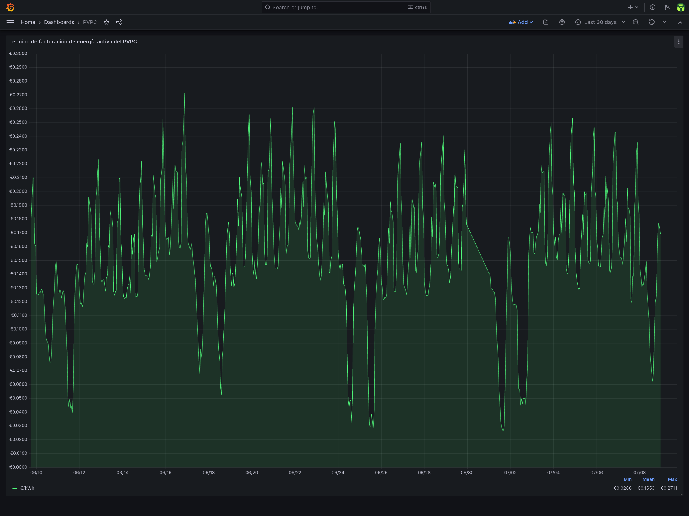

# pvpc-exporter

CLI tool that uploads the PVPC €/MWh data from REData API to influxdb on a daily basis

## Dependencies

- [go](https://go.dev/)
- [influxdb v2+](https://docs.influxdata.com/influxdb/v2.6/)
- Optional:
  - [make](https://www.gnu.org/software/make/) - for automatic installation support
  - [docker](https://docs.docker.com/)
  - [systemd](https://systemd.io/)

## Relevant documentation

- [REData API](https://www.ree.es/en/apidatos)
- [InfluxDB API](https://docs.influxdata.com/influxdb/v2.6/write-data/developer-tools/api/)
- [Systemd Timers](https://www.freedesktop.org/software/systemd/man/systemd.timer.html)
- [reddec/compose-scheduler](https://github.com/reddec/compose-scheduler)

## Installation

### With Docker

#### docker-compose

1. Configure `pvpc_exporter.json` (see the configuration section below).
1. Run it.

   ```bash
   docker compose up --detach
   ```

#### docker build & run

1. Build the docker image.

   ```bash
   docker build . --tag pvpc-exporter
   ```

1. Configure `pvpc_exporter.json` (see the configuration section below).
1. Run it.

  ```bash
    docker run --rm --tty --interactive --read-only --cap-drop ALL --security-opt no-new-privileges:true --cpus 2 -m 64m --pids-limit 16 --volume ./pvpc_exporter.json:/app/pvpc_exporter.json:ro ghcr.io/rare-magma/pvpc-exporter:latest
  ```

### With the Makefile

For convenience, you can install this exporter with the following command or follow the manual process described in the next paragraph.

```bash
make build
make install
$EDITOR $HOME/.config/pvpc_exporter.json

```

### Manually

1. Build `pvpc_exporter` with:

    ```bash
    go build -ldflags="-s -w" -o pvpc_exporter main.go
    ```

2. Copy `pvpc_exporter` to `$HOME/.local/bin/`.

3. Copy `pvpc_exporter.json` to `$HOME/.config/`, configure it (see the configuration section below) and make it read only.

4. Copy the systemd unit and timer to `$HOME/.config/systemd/user/`:

    ```bash

    cp pvpc-exporter.* $HOME/.config/systemd/user/

    ```

5. and run the following command to activate the timer:

    ```bash

    systemctl --user enable --now pvpc-exporter.timer

    ```

It's possible to trigger the execution by running manually:

```bash

systemctl --user start pvpc-exporter.service

```

### Config file

The config file has a few options:

```json
{
 "InfluxDBHost": "influxdb.example.com",
 "InfluxDBApiToken": "ZXhhbXBsZXRva2VuZXhhcXdzZGFzZGptcW9kcXdvZGptcXdvZHF3b2RqbXF3ZHFhc2RhCg==",
 "Org": "home",
 "Bucket": "pvpc",
}
```

- `InfluxDBHost` should be the FQDN of the influxdb server.
- `Org` should be the name of the influxdb organization that contains the pvpc price data bucket defined below.
- `Bucket` should be the name of the influxdb bucket that will hold the pvpc price data.
- `InfluxDBApiToken` should be the influxdb API token value.
  - This token should have write access to the `Bucket` defined above.

## Exporting prices for dates in the past

If the cli is passed a number with the `--days` cli flag, it will query the REData API for an interval in the past instead of the default date of "today".

This argument should correspond to the number of days in the past relative to the current date.
Take into account that the REData API doesn't allow queries for dates prior to 2014-01-01.

Example:

```bash

~/.local/bin/pvpc_exporter --days 30

```

A simple bash loop can be used to query the API with an interval between "today" and 15 days ago:

```bash

for i in {0..15}; do echo "Exporting data from $(date -I -d "$i days ago")" && ~/.local/bin/pvpc_exporter --days "$i"; done

```

## Troubleshooting

Run the tool manually with go set to debug:

```bash

GODEBUG=http1debug=2 $HOME/.local/bin/pvpc_exporter

```

Check the systemd service logs and timer info with:

```bash

journalctl --user --unit pvpc-exporter.service
systemctl --user list-timers

```

## Exported metrics

- price: The pvpc price in €/MWh

## Exported metrics example

```bash

pvpc_price price=63.54 1672610400

```

## Example grafana dashboard

In `pvpc-dashboard.json` there is an example of the kind of dashboard that can be built with `pvpc-exporter` data:



Import it by doing the following:

1. Create a dashboard
2. Click the dashboard's settings button on the top right.
3. Go to JSON Model and then paste there the content of the `pvpc-dashboard.json` file.

## Uninstallation

### With the Makefile

For convenience, you can uninstall this exporter with the following command or follow the process described in the next paragraph.

```bash

make uninstall

```

### Manually

Run the following command to deactivate the timer:

```bash

systemctl --user disable --now pvpc-exporter.timer

```

Delete the following files:

```bash

~/.local/bin/pvpc_exporter
~/.config/pvpc_exporter.json
~/.config/systemd/user/pvpc-exporter.timer
~/.config/systemd/user/pvpc-exporter.service

```

## Credits

- [reddec/compose-scheduler](https://github.com/reddec/compose-scheduler)

This project takes inspiration from the following:

- [rare-magma/aemet-exporter](https://github.com/rare-magma/pbs-exporter)
